<div align="center">

<a href="#español">🇲🇽 Español</a> &nbsp;·&nbsp; <a href="#english">🇺🇸 English</a>

# 💰 SmartBudget

[](LICENSE)
[](https://smartbudget-chi.vercel.app/)
[](https://smartbudget-api-r5kp.onrender.com)
[](https://react.dev)
[](https://nodejs.org)

**Personal budget tracker powered by Claude AI** — track spending, auto-categorize transactions, and get AI-generated monthly insights.

**[🚀 Live Demo](https://smartbudget-chi.vercel.app/)**

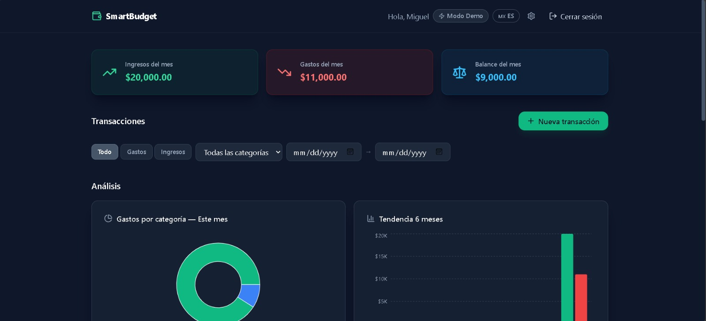

</div>

---

<a id="español"></a>

## 🇲🇽 Español

### ¿Qué es SmartBudget?

SmartBudget es una aplicación web full-stack para gestionar finanzas personales. Permite registrar ingresos y gastos, y usa la IA de Anthropic Claude para categorizarlos automáticamente y generar reportes mensuales con insights accionables.

El proyecto implementa un modelo **BYOK (Bring Your Own Key)**: los usuarios pueden aportar su propia API key de Anthropic (encriptada con AES-256-GCM en base de datos) para desbloquear límites extendidos. Sin clave propia, la app funciona en modo demostración con el key del servidor.

---

### ✨ Features principales

- 🔐 **Autenticación JWT** con sesión persistente y logout automático en 401
- 💰 **CRUD de transacciones** — crear, editar, eliminar con confirmación animada
- 🤖 **Categorización automática** vía Claude Haiku con fallback inteligente
- 📊 **Dashboard con 4 visualizaciones** — pie chart, bar chart, área y ranking de categorías (Recharts)
- 📈 **Reporte mensual IA** — análisis completo con patrones y recomendaciones personalizadas
- 🔑 **BYOK con encriptación AES-256-GCM** — la API key nunca se almacena en texto plano
- 🌎 **Multiidioma ES/EN** — detección automática + toggle manual
- 📱 **Responsive** — mobile-first, funciona en todos los tamaños
- 🎨 **Dark mode nativo** con micro-animaciones (Framer Motion)
- ⚡ **Rate limiting inteligente** — diferenciado por usuario y por modo BYOK

---

### 🛠 Stack tecnológico

| Capa | Tecnología | Versión |
|---|---|---|
| **Frontend** | React + Vite + Tailwind CSS | 19 / 6 / 3 |
| **Routing** | React Router v7 | 7 |
| **Animaciones** | Framer Motion | 12 |
| **Gráficas** | Recharts | 3 |
| **i18n** | react-i18next + i18next | 17 / 26 |
| **Backend** | Node.js + Express | 20+ / 5 |
| **Base de datos** | MongoDB Atlas + Mongoose | 8 |
| **Autenticación** | JSON Web Tokens (JWT) | — |
| **Seguridad** | Helmet + bcryptjs + AES-256-GCM | — |
| **IA** | Anthropic Claude Haiku | claude-haiku-4-5 |
| **Deploy** | Vercel (frontend) + Render (backend) | — |

---

### 📸 Capturas de pantalla

| Dashboard con visualizaciones | Formulario de transacciones |
|---|---|
|  | 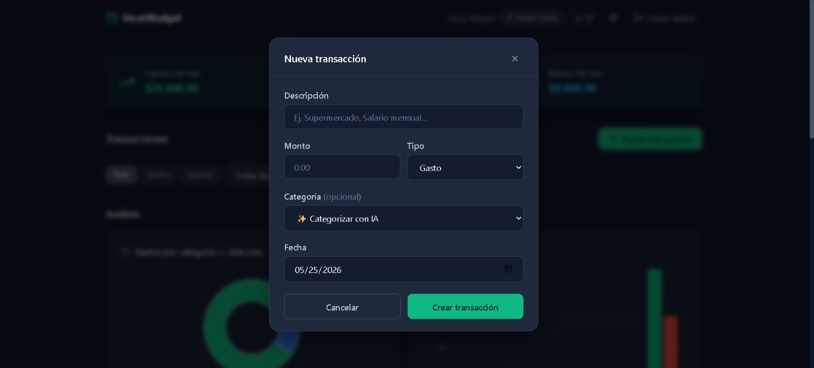 |

| Configuración BYOK | Reporte mensual IA |
|---|---|
| 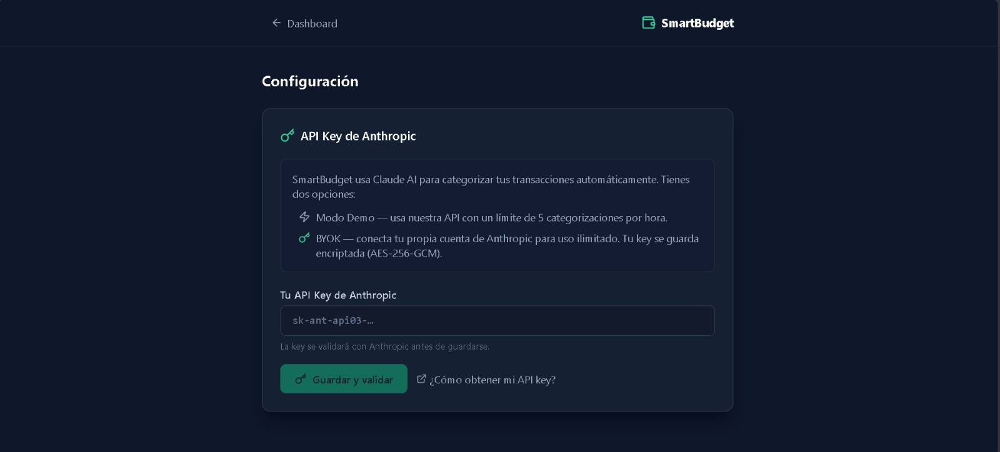 | 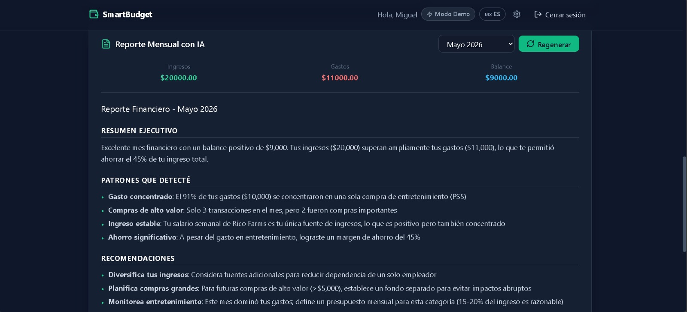 |

| Login | Vista mobile |
|---|---|
| 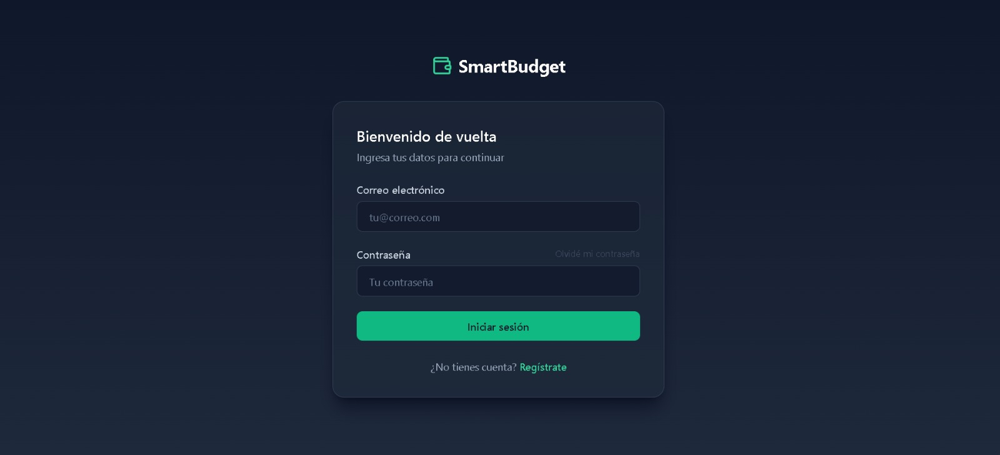 | 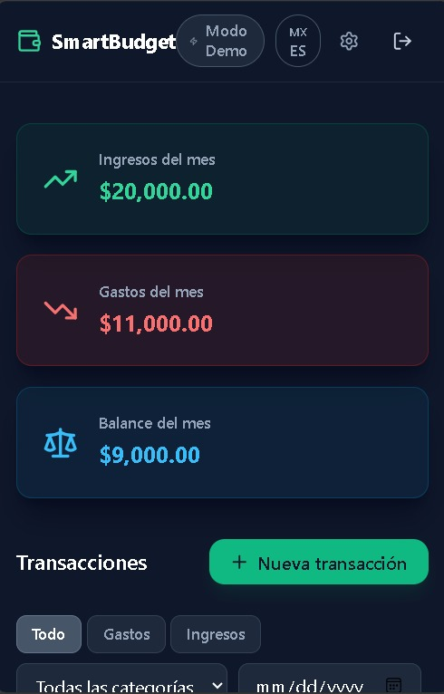 |

---

### 🏗 Arquitectura

```
┌─────────────────────────────────────────────────────────────────┐
│  Usuario                                                         │
│    │                                                             │
│    ▼                                                             │
│  React SPA (Vercel) ──── HTTPS + JWT ────► Express API (Render) │
│                                                  │               │
│                               ┌──────────────────┤              │
│                               │                  │              │
│                               ▼                  ▼              │
│                        MongoDB Atlas      Anthropic Claude API   │
│                        (datos cifrados)   (categorización/       │
│                                            reportes)             │
└─────────────────────────────────────────────────────────────────┘
```

El frontend es una SPA estática servida desde Vercel. Toda la lógica de negocio vive en el backend Express (Render). MongoDB Atlas almacena los datos; las API keys de usuario se almacenan **siempre cifradas** con AES-256-GCM.

---

### 🧠 Decisiones técnicas relevantes

| Decisión | Justificación |
|---|---|
| **AES-256-GCM para BYOK** | Cifrado autenticado — detecta manipulación del ciphertext, a diferencia de AES-CBC |
| **JWT en localStorage + interceptor 401** | Simplicidad en una SPA; el interceptor limpia el token y redirige automáticamente al expirar |
| **Output space constraining en prompts** | El prompt de categorización lista solo las categorías válidas; Claude no puede inventar otras |
| **Rate limiting BYOK-aware** | Los usuarios con clave propia evitan el rate limit del servidor; cada key tiene su propio cupo de Anthropic |
| **Multi-tenant por user._id en queries** | Todas las queries de Mongoose filtran por `user: req.user._id` — nunca se exponen datos cruzados |
| **Stats calculadas en servidor, IA solo interpreta** | El LLM recibe estadísticas ya calculadas (suma, promedio, top categorías) para reducir tokens y mejorar precisión |
| **Framer Motion AnimatePresence** | Exit animations en transacciones eliminadas para feedback visual inmediato sin parpadeos |

---

### 🚀 Cómo correrlo localmente

**Prerequisitos:** Node.js 20+, cuenta en MongoDB Atlas, cuenta en Anthropic (opcional para modo demo)

#### Backend

```bash
cd backend
npm install
cp .env.example .env   # Editar con tus valores reales
npm run dev            # Levanta en http://localhost:5000
```

Variables de entorno necesarias (ver [`backend/.env.example`](backend/.env.example)):

```env
PORT=5000
MONGODB_URI=mongodb+srv://...
JWT_SECRET=<64 chars hex>
ENCRYPTION_SECRET=<64 chars hex>
ANTHROPIC_API_KEY=sk-ant-api03-...
NODE_ENV=development
FRONTEND_URL=http://localhost:5173
```

#### Frontend

```bash
cd frontend
npm install
cp .env.example .env.local   # Editar si el backend no corre en :5000
npm run dev                  # Levanta en http://localhost:5173
```

Variable requerida (ver [`frontend/.env.example`](frontend/.env.example)):

```env
VITE_API_URL=http://localhost:5000
```

---

### ⚠️ Limitaciones conocidas

- **Cold starts en Render** — el plan free hiberna el servicio tras 15 min de inactividad; el primer request puede tardar ~30 s
- **Sin tests automatizados** — priorizado UX y features en esta iteración; pendiente Vitest + Supertest
- **JWT en localStorage** — expuesto a XSS teóricamente; httpOnly cookies es el approach correcto para producción real
- **Sin paginación cursor-based** — la lista de transacciones carga todas de una (aceptable para uso personal, no para escala)
- **Rate limiting en memoria** — se reinicia al reiniciar el servidor; Redis resolvería esto en multi-instancia

---

### 🗺 Roadmap

- [ ] Tests unitarios e integración (Vitest + Supertest)
- [ ] httpOnly cookies + protección CSRF
- [ ] Paginación con cursor para transacciones
- [ ] Exportar a CSV / PDF
- [ ] Notificaciones push de presupuesto
- [ ] App móvil React Native

---

### 👤 Autor

**Miguel Ángel Córdova**

[](https://linkedin.com/in/miguel-angel-córdova)
[](https://github.com/MiguelC121913)

---

<div align="right"><a href="#top">↑ Volver arriba</a></div>

---
---

<a id="english"></a>

## 🇺🇸 English

### What is SmartBudget?

SmartBudget is a full-stack personal finance web app. It lets you log income and expenses, and uses Anthropic's Claude AI to automatically categorize transactions and generate monthly reports with actionable insights.

The project implements a **BYOK (Bring Your Own Key)** model: users can provide their own Anthropic API key (encrypted with AES-256-GCM in the database) to unlock extended limits. Without a personal key, the app runs in demo mode using the server's key.

---

### ✨ Key features

- 🔐 **JWT authentication** with persistent sessions and automatic logout on 401
- 💰 **Transaction CRUD** — create, edit, delete with animated confirmation
- 🤖 **Auto-categorization** via Claude Haiku with intelligent fallback
- 📊 **Dashboard with 4 charts** — pie, bar, area, and category ranking (Recharts)
- 📈 **AI monthly report** — full analysis with spending patterns and personalized recommendations
- 🔑 **BYOK with AES-256-GCM encryption** — the API key is never stored in plain text
- 🌎 **ES/EN multilanguage** — auto-detection + manual toggle
- 📱 **Responsive** — mobile-first, works on all screen sizes
- 🎨 **Native dark mode** with micro-animations (Framer Motion)
- ⚡ **Smart rate limiting** — differentiated per user and BYOK mode

---

### 🛠 Tech stack

| Layer | Technology | Version |
|---|---|---|
| **Frontend** | React + Vite + Tailwind CSS | 19 / 6 / 3 |
| **Routing** | React Router v7 | 7 |
| **Animations** | Framer Motion | 12 |
| **Charts** | Recharts | 3 |
| **i18n** | react-i18next + i18next | 17 / 26 |
| **Backend** | Node.js + Express | 20+ / 5 |
| **Database** | MongoDB Atlas + Mongoose | 8 |
| **Auth** | JSON Web Tokens (JWT) | — |
| **Security** | Helmet + bcryptjs + AES-256-GCM | — |
| **AI** | Anthropic Claude Haiku | claude-haiku-4-5 |
| **Deploy** | Vercel (frontend) + Render (backend) | — |

---

### 📸 Screenshots

| Dashboard with charts | Transaction form |
|---|---|
| 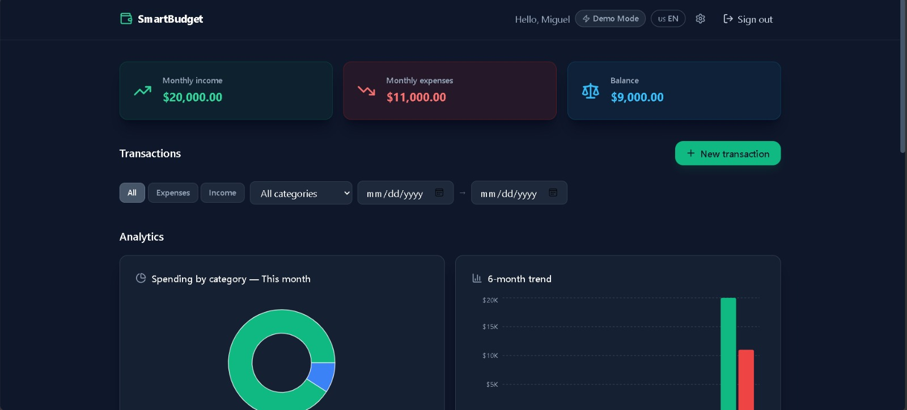 | 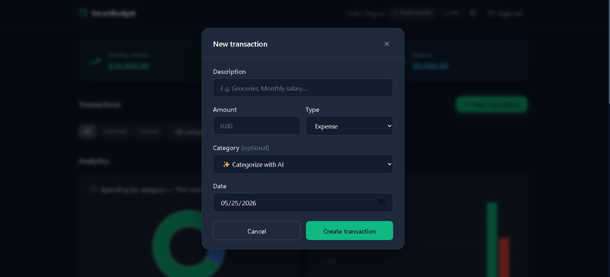 |

| BYOK Settings | AI Monthly Report |
|---|---|
| 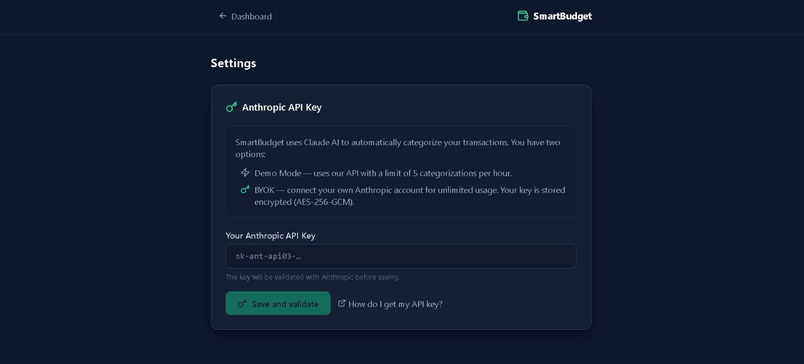 | 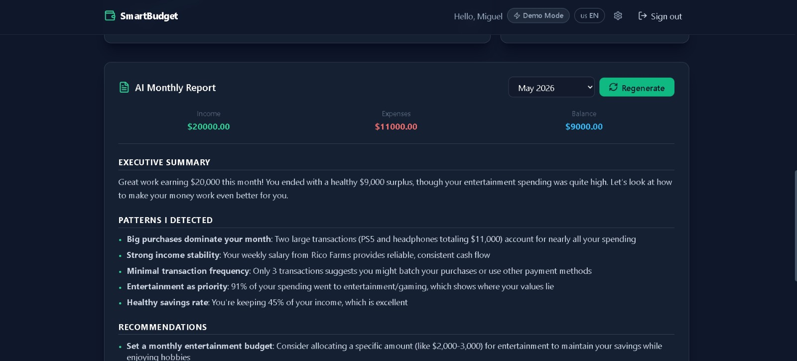 |

| Login | Mobile view |
|---|---|
| 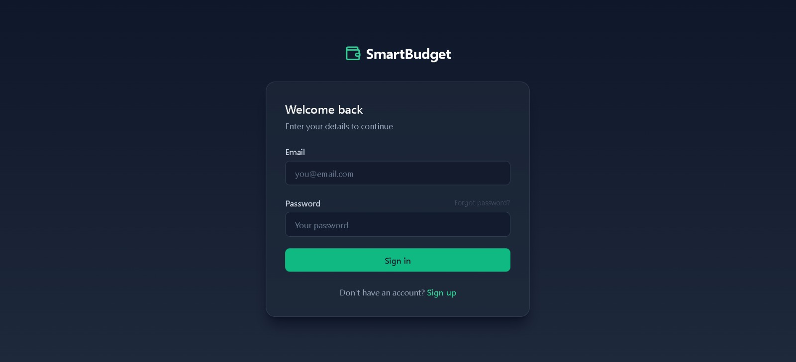 | 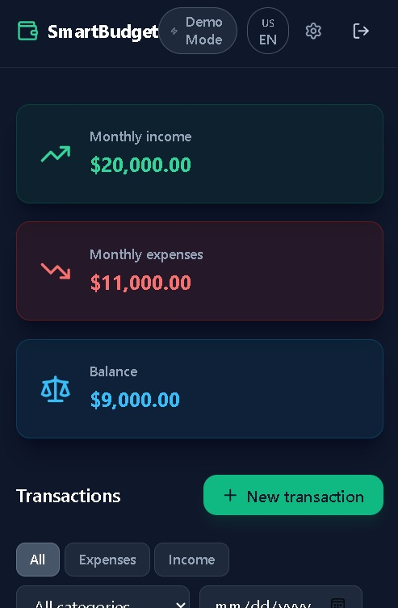 |

---

### 🏗 Architecture

```
┌─────────────────────────────────────────────────────────────────┐
│  User                                                            │
│    │                                                             │
│    ▼                                                             │
│  React SPA (Vercel) ──── HTTPS + JWT ────► Express API (Render) │
│                                                  │               │
│                               ┌──────────────────┤              │
│                               │                  │              │
│                               ▼                  ▼              │
│                        MongoDB Atlas      Anthropic Claude API   │
│                        (encrypted data)   (categorization /      │
│                                            monthly reports)      │
└─────────────────────────────────────────────────────────────────┘
```

The frontend is a static SPA served from Vercel. All business logic lives in the Express backend (Render). MongoDB Atlas stores the data; user API keys are **always stored encrypted** with AES-256-GCM.

---

### 🧠 Technical decisions

| Decision | Rationale |
|---|---|
| **AES-256-GCM for BYOK** | Authenticated encryption — detects ciphertext tampering, unlike AES-CBC |
| **JWT in localStorage + 401 interceptor** | Simplicity in a SPA; the interceptor clears the token and redirects automatically on expiry |
| **Output space constraining in prompts** | The categorization prompt lists only valid categories; Claude cannot invent new ones |
| **BYOK-aware rate limiting** | Users with their own key bypass the server rate limit; each key has its own Anthropic quota |
| **Multi-tenant via user._id in queries** | All Mongoose queries filter by `user: req.user._id` — no cross-user data exposure |
| **Stats computed server-side, AI only interprets** | The LLM receives pre-calculated stats (sums, averages, top categories) to reduce tokens and improve accuracy |
| **Framer Motion AnimatePresence** | Exit animations on deleted transactions for immediate visual feedback without flicker |

---

### 🚀 Run locally

**Prerequisites:** Node.js 20+, MongoDB Atlas account, Anthropic account (optional for demo mode)

#### Backend

```bash
cd backend
npm install
cp .env.example .env   # Edit with your real values
npm run dev            # Starts at http://localhost:5000
```

Required environment variables (see [`backend/.env.example`](backend/.env.example)):

```env
PORT=5000
MONGODB_URI=mongodb+srv://...
JWT_SECRET=<64 chars hex>
ENCRYPTION_SECRET=<64 chars hex>
ANTHROPIC_API_KEY=sk-ant-api03-...
NODE_ENV=development
FRONTEND_URL=http://localhost:5173
```

#### Frontend

```bash
cd frontend
npm install
cp .env.example .env.local   # Edit if backend isn't on :5000
npm run dev                  # Starts at http://localhost:5173
```

Required variable (see [`frontend/.env.example`](frontend/.env.example)):

```env
VITE_API_URL=http://localhost:5000
```

---

### ⚠️ Known limitations

- **Render cold starts** — the free plan hibernates after 15 min of inactivity; the first request may take ~30 s
- **No automated tests** — UX and features were prioritized in this iteration; Vitest + Supertest is pending
- **JWT in localStorage** — theoretically vulnerable to XSS; httpOnly cookies is the correct approach for real production
- **No cursor-based pagination** — the transaction list loads all at once (fine for personal use, not for scale)
- **In-memory rate limiting** — resets on server restart; Redis would solve this in multi-instance deployments

---

### 🗺 Roadmap

- [ ] Unit and integration tests (Vitest + Supertest)
- [ ] httpOnly cookies + CSRF protection
- [ ] Cursor-based pagination for transactions
- [ ] Export to CSV / PDF
- [ ] Budget push notifications
- [ ] React Native mobile app

---

### 👤 Author

**Miguel Ángel Córdova**

[](https://linkedin.com/in/miguel-angel-córdova)
[](https://github.com/MiguelC121913)

---

<div align="right"><a href="#top">↑ Back to top</a></div>
